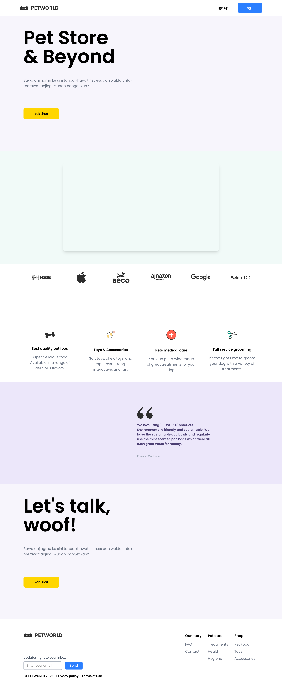

# 🚀 PROYEK LANDING PAGE UTS MATA KULIAH PEMROGRAMAN BERBASIS WEB

## 📝 Deskripsi Proyek

Landing page yang berisi tentang Pet Store atau toko yang menjual alat-alat untuk hewan peliharaan.

## Link Proyek

- [https://rai-uts-smt4.vercel.app/](https://rai-uts-smt4.vercel.app/)

## 🎥 Demonstrasi Proyek

[](https://rai-uts-smt4.vercel.app/)

## 🛠 Arsitektur

- Component-Based (Functional Component)

## 🚀 Pertama-tama

### Teknologi yang Digunakan

- [React JS](https://reactjs.org/)
- [Next JS](https://nextjs.org/)
- [Tailwind CSS](https://tailwindcss.com/)
- [Git](https://git-scm.com/)
- [Node JS v22](https://nodejs.org/)
- [Visual Studio Code](https://code.visualstudio.com/)

### Instalasi

1. Clone repository ini

```bash
git clone https://github.com/raiwirawan/landing-page-uts-pbw.git
```

2. Pergi ke direktori proyek

```bash
cd landing-page-uts-pbw
```

3. Instal semua dependensi yang dibutuhkan

```bash
npm install
```

4. Checkout ke branch `final`

```bash
git checkout final
```

5. Jalankan aplikasi

```bash
npx next dev
```

or

```bash
npm run dev
```

## 🤝 Contributing

1. Fork repository ini
2. Buat branch fitur baru (git checkout -b feature/YourFeature)
3. Commit perubahan (git commit -m 'Add some feature')
4. Push ke branch (git push origin feature/YourFeature)
5. Buka pull request
6. Tunggu review dari pemilik repository
7. Merge pull request
8. Hapus branch yang sudah di-merge
9. Berikan bintang ⭐ pada repository ini jika kamu suka
